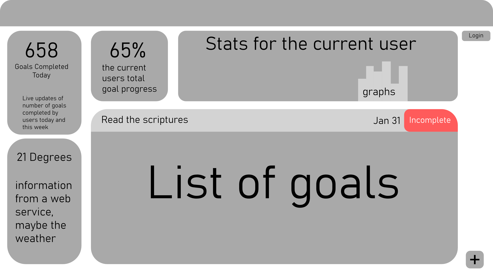

# Goal Tracker

## SSH Into the Server

ssh -i ~/Documents/keys/production.pem ubuntu@18.190.146.155

## Design

Have you ever wanted to have a way to organize and store your goals online. This goal application will provide a convenient way for you to
store and keep track of your goals. My hope is that using this application will help you become a better person every single day because it
is the small things we do every day that determine our future. Not only will you be able to store your goals you will also be able to see
personalized statistics of the progress you have made.



## Key Features:

- Secure login over HTTPS
- Display goals
- Goals are persistently stored
- Real time statistics of goals completed by all users
- Information provided by a web service

# Learned in CS 260

**_Setting up the start up_**
I learned how to use git in VS code which I have never done before. I've always used either the command line or github desktop.

**_Simon HTML_**
I learned how to organize html elements effectivly using a header, main, and footer in the body of the html. I also learned how to organize a
table with a header when setting up the scores page of the simon clone.

**_Simon CSS_**
I learned how to effectively use bootstrap and css in tandem to create an asthetically appealing website. I thought it was a bit repetitive to reimplement the header and footer for each page so I am looking forward to getting into more modular designs with react. I also learned more about the bootstrap fluid container.

**_Start Up HTML and CSS_**
I learned a lot about using rows and columns with bootstrap and eventually found that the best attribute for each column in a row is col-auto. It just does what I expect. I also learned that if you want objects on complete
opposite sides of a row use justify-content-between. Another very useful thing that I learned was to use list-group on a list to quickly and easily make a list look a lot better. When using bootstrap to its fullest very little css needs to be placed in a seperate file so a majority of the code lies right with the html.

**_Simon Javascript_**
The most interesting thing I learend from the simon javascript project was the use of localStorage to save data between runs of the code. Initially I thought this kind of process would be more difficult than it is. However, this is done quite simply by using a string as a key to the data and accessing it later with that string key. I also learned that a great way to select elements that are needed for javascript functionality is by their id using querySelector.

**_Start Up Javascript_**
I learned a lot about injecting html using javascript. One of the problems I was facing was that I needed to inject list items that contained buttons that did different things based on the parent element. I learned the importance of having a unique id for each list item so that I can access it using javascript. I also learned that you can put parameters on onclick functions even when injecting html. Initially I thought I would need to use addEventListener but it worked to have a paramatized function injected into the html.

**_Simon Service_**
From this project I learned a lot about combining expresss with existing code. For example storing the scores was previously completly reliant on localStorage to save the scores but with the addition of the service we are still using localStorage to save scores but we combine that with getting scores from the /api/scores endpoint and adding those to the localStorage so that localStorage and endpoint scores are saved in the same location. I thought it was a really neat way to keep track of scores.

**_Simon DB_**
The process of using a mongodb in javascript goes as follows: create a database cluster on the mongodb website making sure that the correct ip address has access, install the mongodb npm module, add environment variables for username, password, and hostname, use the environment variables to crate a MongoClient, get references to the collections you need, and finally create and export functions that modify the databse collections such as adding, getting, removing and updating the collection. Then those exported functions can be used dynamically throughout the project to modify and retrieve content from the database.

**_Simon Login_**
There are two important things that I learned studying the code of this simon project. The first was proper error handling in regards to the login portion. For example when creating a user we first check if a user with that email is already in the database and throw an error if they are. A similar thing happens with the login but if the there is no user then it throws an error of being unauthorized. Another thing I learned was how to store an authorization token as a cookie, which is something I have never seen done before.

**_Simon Websocket_**
Websockets are the most complex thing we have learned so far so I would make sure to refer to peerProxy.js and play.js in simon-websocket project for specific info on how to set up. peerProxy.js handles creating a websocket, keeping track of the connections, keeping connections alive, closing connections, and forwarding messages. play.js configures the websocket with onopen, onclose, and onmessage listeneres, handles showing messages via html injection, and broadcasts events that occur during the game such as a game start and a game end with score.

## Console Commands
- **echo** - Output the parameters of the command
- **cd** - Change directory
- **mkdir** - Make directory
- **rmdir** - Remove directory
- **rm** - Remove file(s)
- **mv** - Move file(s)
- **cp** - Copy files
- **ls** - List files
- **curl** - Command line client URL browser
- **grep** - Regular expression search
- **find** - Find files
- **top** - View running processes with CPU and memory usage
- **df** - View disk statistics
- **cat** - Output the contents of a file
- **less** - Interactively output the contents of a file
- **wc** - Count the words in a file
- **ps** - View the currently running processes
- **kill** - Kill a currently running process
- **sudo** - Execute a command as a super user (admin)
- **ssh** - Create a secure shell on a remote computer
- **scp** - Securely copy files to a remote computer
- **history** - Show the history of commands
- **ping** - Check if a website is up
- **tracert** - Trace the connections to a website
- **dig** - Show the DNS information for a domain
- **man** - Look up a command in the manual
- **chmod** - Makes a script executable

- `|` - Take the output from the command on the left and _pipe_, or pass, it to the command on the right
- `>` - Redirect output to a file. Overwrites the file if it exists
- `>>` - Redirect output to a file. Appends if the file exists

## DNS
- **NS** - contains the names of the authoratative name servers taht aurhoize you to place DNS records in this DNS server.
- **SOA** - Start of Authority. Provides contact information about the owner of this domain name.
- **CNAME** - Point to another DNS record.
- **A** - Point to an IP address.

## HTML
| element   | meaning                                                                |
| --------- | ---------------------------------------------------------------------- |
| `html`    | The page container                                                     |
| `head`    | Header information                                                     |
| `title`   | Title of the page                                                      |
| `meta`    | Metadata for the page such as character set or viewport settings       |
| `script`  | JavaScript reference. Either a external reference, or inline           |
| `include` | External content reference                                             |
| `body`    | The entire content body of the page                                    |
| `header`  | Header of the main content                                             |
| `footer`  | Footer of the main content                                             |
| `nav`     | Navigational inputs                                                    |
| `main`    | Main content of the page                                               |
| `section` | A section of the main content                                          |
| `aside`   | Aside content from the main content                                    |
| `div`     | A block division of content                                            |
| `span`    | An inline span of content                                              |
| `h<1-9>`  | Text heading. From h1, the highest level, down to h9, the lowest level |
| `p`       | A paragraph of text                                                    |
| `b`       | Bring attention                                                        |
| `table`   | Table                                                                  |
| `tr`      | Table row                                                              |
| `th`      | Table header                                                           |
| `td`      | Table data                                                             |
| `ol,ul`   | Ordered or unordered list                                              |
| `li`      | List item                                                              |
| `a`       | Anchor the text to a hyperlink - use href for link                     |
| `img`     | Graphical image reference                                              |
| `dialog`  | Interactive component such as a confirmation                           |
| `form`    | A collection of user input                                             |
| `input`   | User input field                                                       |
| `audio`   | Audio content                                                          |
| `video`   | Video content                                                          |
| `svg`     | Scalable vector graphic content                                        |
| `iframe`  | Inline frame of another HTML page                                      |

HTML Comments
```html
<!-- commented text -->
```

HTML Form Input
| Element    | Meaning                          | Example                                        |
| ---------- | -------------------------------- | ---------------------------------------------- |
| `form`     | Input container and submission   | `<form action="form.html" method="post">`      |
| `fieldset` | Labeled input grouping           | `<fieldset> ... </fieldset>`                   |
| `input`    | Multiple types of user input     | `<input type="" />`                            |
| `select`   | Selection dropdown               | `<select><option>1</option></select>`          |
| `optgroup` | Grouped selection dropdown       | `<optgroup><option>1</option></optgroup>`      |
| `option`   | Selection option                 | `<option selected>option2</option>`            |
| `textarea` | Multiline text input             | `<textarea></textarea>`                        |
| `label`    | Individual input label           | `<label for="range">Range: </label>`           |
| `output`   | Output of input                  | `<output for="range">0</output>`               |
| `meter`    | Display value with a known range | `<meter min="0" max="100" value="50"></meter>` |

## CSS

- **CSS Box Model** - Outside to in: margin -> border -> padding -> content
- **Padding** - Puts space around the content of the selected element
- **Load Fonts** - @import url('font.url')
- **Basic Selector** - body {}
- **Class Selector** - .input {}
- **ID Selector** - #main-content {}
- **Attribute Selector** - p[class='summary'] {}
- **Psudo Selector** - section:hover {}
- **Combination of Selectors** - div .input {} = Inputs with a class of 'input' with a parent that is a div.

| Combinator       | Meaning                    | Example        | Description                                |
| ---------------- | -------------------------- | -------------- | ------------------------------------------ |
| Descendant       | A list of descendants      | `body section` | Any section that is a descendant of a body |
| Child            | A list of direct children  | `section > p`  | Any p that is a direct child of a section  |
| General sibling  | A list of siblings         | `p ~ div`      | Any p that has a div sibling               |
| Adjacent sibling | A list of adjacent sibling | `p + div`      | Any p that has an adjacent div sibling     |

## Javascript
Ways to add javascript in HTML
- `<script>2+2</script>`
- `<script src='main.js'/>`
- `<div onclick='1+1'></div>`

**Javascript object** - { n: 1 }

## Javascript Functions

**Basic Functions**
- `function f(x) {}`
- `const f = function(x) {}`

**Arrow Functions**
- `const f = (x) => {}`
- `(a, b) => a + b`

**Promises**
- If it resolves calls 'then' and not 'catch'
- If it rejects or throws an exception calls 'catch' and not 'then'
- Always calls 'finally'
- Works off to the side so code after the promise starts could get called before code in the promise runs

**Async and Await**
- Calling an async functio nwith await waits for the function to finish before executing further.

## Javascript DOM
- **document.querySelectorAll('p')** - selects all paragraph elements in the document
- **document.querySelector('p')** - selects the first paragraph element in the document
- **el.parentElement.removeChild(el)** - removes the element el from the document
- **el.appendChild(newChild)** - Inserts newChild as a child of el
- **el.textContext** - contains all of the elements text
- **el.innerHTML** - contains a textual representation of an elements HTML content. Can inject entire blocks of code using this.

## JSON
```json
{
  "class": {
    "title": "web programming",
    "description": "Amazing"
  },
  "enrollment": ["Marco", "Jana", "فَاطِمَة"],
  "start": "2025-02-01",
  "end": null
}
```

## Regular Expressions
`text.match(/A|f/i)`
Matches if text contains a capital or lowercase A or f

## Rest and Spread

**Rest**
```js
function hasNumber(test, ...numbers) {
  return numbers.some((i) => i === test);
}

hasNumber(2, 1, 2, 3);
// RETURNS: true
```

**Spread**
```js
function person(firstName, lastName) {
  return { first: firstName, last: lastName };
}

const p = person(...['Ryan', 'Dahl']);
console.log(p);
// OUTPUT: {first: 'Ryan', last: 'Dahl'}
```

